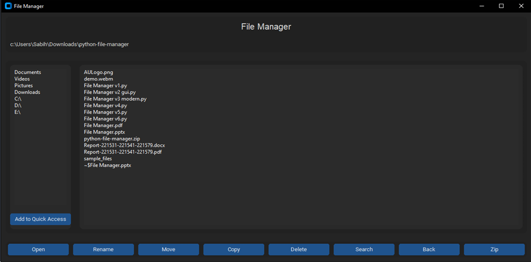

# Python File Manager

A Python-based GUI file management application that simplifies the process of navigating, organizing, and managing files and directories. Built using `customtkinter` for a modern interface, this tool is ideal for users looking for an intuitive and efficient way to handle everyday file operations.

## Table of Contents

- [Features](#features)
- [Screenshots](#screenshots)
- [Installation](#installation)
- [Usage](#usage)
- [Dependencies](#dependencies)
- [Code Structure](#code-structure)
- [Error Handling](#error-handling)
- [Contributing](#contributing)
- [License](#license)

## Features

- **Navigation**: Easily browse through directories and open files with a double-click.
- **Quick Access**: Access common folders like Documents, Videos, Pictures, and Downloads instantly.
- **File Operations**: Perform basic file operations including renaming, moving, copying, and deleting files or directories.
- **Search Functionality**: Quickly find files or folders within a directory and its subdirectories.
- **Dynamic Path Display**: Keep track of the current working directory as you navigate.
- **Customizable User Interface**: Modern dark-themed UI using `customtkinter` for a visually appealing user experience.
- **Zip Functionality**: Select multiple files and directories to compress into a ZIP file.

## Screenshots


_The main interface of the Python File Manager showing the directory navigation, quick access panel, and file operations._

## Installation

To set up the File Manager on your local machine, follow these steps:

1. Clone the repository:

   ```bash
   git clone https://github.com/yourusername/python-file-manager.git
   cd python-file-manager
   ```

2. Install the required dependencies:

   ```bash
   pip install send2trash customtkinter
   ```

3. Run the application:
   ```bash
   python "File Manager v6.py"
   ```

## Usage

1. **Navigate**: Double-click on items in the list to navigate into directories or open files.
2. **Quick Access**: Double-click on common locations in the left panel for instant access.
3. **File Operations**:
   - Select an item and click on "Open" to open it.
   - Click on "Rename" to change the name of the selected item.
   - Click on "Move" or "Copy" to move or copy the selected item to another directory.
   - Click on "Delete" to remove the selected item.
4. **Search**: Click on "Search" to look for files or folders by name within the current directory and subdirectories.
5. **Zip**: Select multiple items and click on "Zip" to compress them into a ZIP file.
6. **Back**: Use the "Back" button to navigate to the parent directory.
7. **Add to Quick Access**: Select a directory and click "Add to Quick Access" for easier future navigation.

## Dependencies

The following Python libraries are used in this project:

- `os`: For interacting with the operating system and managing files.
- `shutil`: To perform high-level file operations like moving and copying.
- `send2trash`: To safely send files to the trash instead of permanently deleting them.
- `customtkinter`: For building a modern-looking graphical user interface.
- `tkinter`: For creating dialogs, message boxes, and basic widgets.
- `psutil`: To detect and list available drives on the system.

Install all dependencies with:

```bash
pip install -r requirements.txt
```

## Code Structure

The core of the application is encapsulated within the `FileManager` class, which extends `ctk.CTk`. Here's a breakdown of its key methods:

- `__init__(self)`: Initializes the main window, sets up the appearance, and defines common locations.
- `create_widgets(self)`: Sets up the UI components like frames, listboxes, and buttons.
- `populate_listbox(self)`: Lists all files and folders in the current directory.
- `on_location_selected(self, event)`: Handles double-clicks on the location list to navigate to selected directories.
- `open_item(self)`: Opens files or navigates into folders.
- `rename_item(self)`: Prompts for a new name and renames the selected item.
- `delete_item(self)`: Deletes files or folders after user confirmation.
- `zip_item(self)`: Compresses selected files or directories into a ZIP archive.

For more details, refer to the source code.

## Error Handling

- **PermissionError**: Displays a user-friendly error message if access to a directory is denied.
- **File Operations**: Confirms with the user before performing critical actions like deletion to prevent accidental data loss.
- **No Selection Warnings**: Alerts the user if no item is selected when attempting to perform operations like renaming or zipping.

## Contributing

Contributions are welcome! If you'd like to contribute to this project, please follow these steps:

1. Fork the repository.
2. Create a new feature branch.
3. Commit your changes.
4. Push to the branch.
5. Open a pull request.

Please ensure your code follows the established style and includes proper documentation.

## License

This project is licensed under the MIT License. See the `LICENSE` file for more details.
